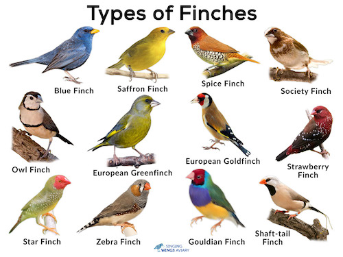

# Finch Collector

### Date: 3/20/2020

#### By: Michael Lackey
#### [Website](https://michaellackey.com/) | [GitHub](https://github.com/mlackey9601) | [LinkedIn](https://www.linkedin.com/in/michaelglackey/) | [GA Profile](https://profiles.generalassemb.ly/michaellackey)
***

### ***Description***

##### Finch Collector is a Django Framework application for tracking bird sightings.
***

### ***Technologies Used***

***

### ***Getting Started***

##### Use this app to keep track of beautiful birds you have spotted.  To get started, just sign up as a new user and start creating your birds!
##### The project itself was deployed using Heroku and can be viewed [here](https://finchcollectoratx.herokuapp.com/).
***

### ***Screenshots***

###### Types of Finches

***

### ***Future Updates***

- [x] ~~Create widget that displays whether the finch has been spotted on the current day~~
- [x] ~~Add the ability for the user to upload their own photo for each finch~~
- [ ] Add custom user models behind the scenes for more customization
***

### ***Credits***

##### Stying: [Materialize](https://materializecss.com/)
***
